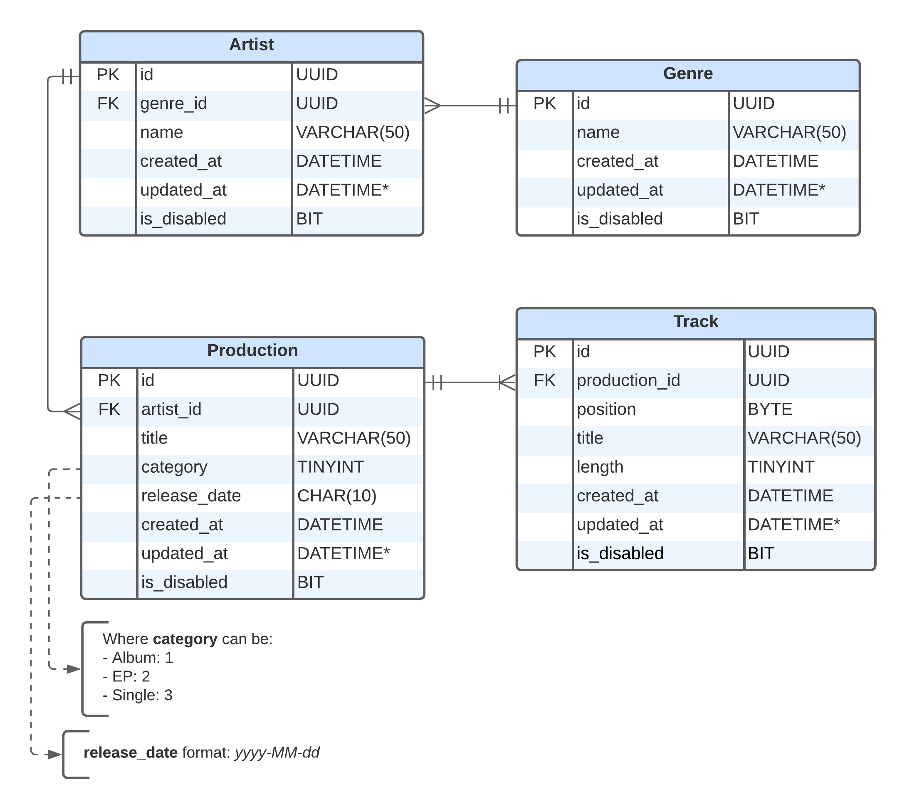

# Music Library


## About
This is a *simple* portfolio project that I develop in my spare time (and which is still ongoing) that aims to provide a **REST API** built in [.NET](https://dotnet.microsoft.com/), to manage music-related content.

The intention of this project is not to present an application rich in business rules, but to expose a series of good practices, conventions and patterns that I am aware of.

## Setup
Before you start, keep in mind that this project was built using **.NET 7 Standard Term Support**, so its [SDK](https://dotnet.microsoft.com/en-us/download) is required to run this application.

### Application
1. Clone the repository:
```bash
git clone https://github.com/rodolfo-brandao/music-library
```

2. Navigate to the `/src` directory:
```bash
cd music-library/src
```

Now, through the [.NET CLI](https://learn.microsoft.com/en-us/dotnet/core/tools/), we will...

3. Restore, build and test the application:
```bash
dotnet restore \
&& dotnet build --no-restore \
&& dotnet test --no-build --verbosity normal
```

### Database
Since the main data schema of this API is relational, the [SQLite](https://www.sqlite.org/index.html) database was used.

Once the application setup is done, now it will be necessary to create the database. This will consist of a `.db` file located in the `MusicLibrary.Data` layer.

#### EF Core Tools
Note that this application was developed using the [Code-First](https://www.entityframeworktutorial.net/code-first/what-is-code-first.aspx) approach, so for that, we will need to install the [EF Core Tools](https://learn.microsoft.com/en-us/ef/core/cli/dotnet).

To do so, simply:

1. Install it through the `dotnet` CLI:
```bash
dotnet tool install --global dotnet-ef
```

2. Then update:
```bash
dotnet tool update --global dotnet-ef
```

#### Migrations
Now let's apply the pre-defined migrations in the `MusicLibrary.Data` layer

1. Inside the `/src/MusicLibrary.Data` directory, create a folder called "SQLite":
```bash
mkdir SQLite
```

2. Now we go back to the `/src` directory and create the `.db` file mentioned previously:
```bash
dotnet ef database update \
--project MusicLibrary.Data \
--startup-project MusicLibrary.Presentation
```

---

After following all the steps, we can now run our project locally:
```bash
dotnet run --project MusicLibrary.Presentation/MusicLibrary.Presentation.csproj
```

With this, the application's Swagger will be available via HTTPS at `localhost:7233` ([here](https://localhost:7233/swagger/index.html)).

## Frameworks, Concepts & Patterns
- [x] .NET 7 STS
- [x] Entity Framework Core
- [x] Code-First
- [x] Domain-driven Design
- [x] Fluent API
- [x] Repository
- [x] Unit of Work

## Notable Libraries
- [x] Bogus
- [x] FluentValidation
- [x] Fluent Assertions
- [x] MediatR
- [x] Moq
- [x] Serilog
- [x] SQLite
- [x] xUnit

## Architecture


## Data Model



## Disclaimers
Although not recommended, the configuration file `appsettings.development.json`, located in the *Presentation* layer, was kept in the repository only to illustrate the idea of a portfolio project, where the concept of this project does not represent any usability in the real world. Besides the fact that no sensitive or relevant information is exposed.

*PS: Feel free to disagree and provide counterpoints by contacting me or opening a pull-request.*

## Postman Collections
[music-library](postman-collections/music-library.json)

## License
[MIT License](LICENSE)
