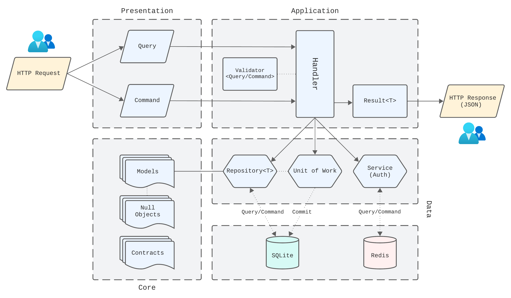

# Music Library


## About
This is a *simple* portfolio project that I develop in my spare time (and which is still ongoing) that aims to provide a **REST API** built in [.NET](https://dotnet.microsoft.com/), to manage music-related content, which exposes interactions between models representing artists, genres and musical productions, as well as their tracks.

The intention of this project is not to present an application rich in business rules, but to expose a series of good practices, conventions and patterns that I am aware of.

## Setup
Before you start, keep in mind that this project was built using **.NET 7 Standard Term Support**, so its [SDK](https://dotnet.microsoft.com/en-us/download) and [CLI](https://learn.microsoft.com/en-us/dotnet/core/tools/) are required to run this application through the .NET cross-platform development environment.

### 1. Application
Clone the repository:
```bash
git clone https://github.com/rodolfo-brandao/music-library
```

Navigate to the `/src` directory:
```bash
cd music-library/src
```

Restore, build and test the application:
```bash
dotnet restore \
&& dotnet build --no-restore \
&& dotnet test --no-build --verbosity normal
```

### 2. Database
Since the main data schema of this API is relational, the [SQLite](https://www.sqlite.org/index.html) database was chosen for this purpose.

Once the application setup is done, now it will be necessary to create its database. In practical terms, this will consist of a `.db` file located in the `MusicLibrary.Data` layer.

#### 2.1 EF Core Tools
Note that this application was developed using the [Code-First](https://www.entityframeworktutorial.net/code-first/what-is-code-first.aspx) approach, and for that, we will need the [EF Core Tools](https://learn.microsoft.com/en-us/ef/core/cli/dotnet).

Install the latest version through the .NET CLI:
```bash
dotnet tool update --global dotnet-ef
```

#### 2.2 Migrations
Now let's create the [migration](https://learn.microsoft.com/en-us/ef/core/managing-schemas/migrations/?tabs=dotnet-core-cli) containing all the DDL scope. 

To do so, in the `src` directory, simply run:
```bash
dotnet ef migrations add InitialCreate \
--project MusicLibrary.Data \
--startup-project MusicLibrary.Presentation
```

> Through this command we are indicating to the `dotnet ef` tool to take the entity mapping configurations located in `MusicLibray.Data/Mappings` and generate the migration files containing the DDL scheme.

After that, you will notice that a folder called `Migrations` has been created inside `MusicLibrary.Data`, it contains all the setup automatically generated by the `dotnet ef` tool.

---

Now let's apply the defined migration. To do so, let's navigate to the `src/MusicLibrary.Data`.

Create a new folder called "SQLite":
```bash
mkdir SQLite
```

Now we go back to the `/src` directory
```bash
cd ..
```

And create the `.db` file mentioned previously:
```bash
dotnet ef database update \
--project MusicLibrary.Data \
--startup-project MusicLibrary.Presentation
```

> This command tells the `dotnet ef` tool to use the newly created migration and apply it to the database connection configured in the `MusicLibrary.Presentation` layer.
---

After following all the steps, we can now run our project locally.

Still in the `src` directory, run:
```bash
dotnet run --project MusicLibrary.Presentation/MusicLibrary.Presentation.csproj
```

With this, the application's Swagger will be available via HTTPS at `localhost:7233` ([here](https://localhost:7233/swagger/index.html)).

## Features
- [x] .NET 7 Standard Term Support
- [x] Domain-driven Design
- [x] Authentication & JWT
- [x] Mediator
- [x] CQRS
- [x] Repository
- [x] Unit of Work
- [x] Null Objects
- [x] Swagger
- [x] Code-First w/ Fluent API
- [x] Unit & Integration Tests

## Databases

- [x] [SQLite](https://www.sqlite.org/index.html)
- [x] [Redis](https://redis.io/)

## Dependencies

The detailed list of all packages used in this project can be accessed [here](docs/Dependencies.md).

## Architecture



## How does it work?

### Commands & Queries

When it comes to the exposed layer of our application, which is called **Presentation**, the first thing we notice in this architecture is the fact that all HTTP requests are segregated into 2 categories:
- Commands
- Queries

Where,
- For requests that consist of commands, the *insertion*, *update* and *deletion* actions can be performed within the database
- As for the requests that deal with queries, only the *reading* action will be performed by the database

Bearing in mind that both actions can occur both in the SQLite and Redis database.

### Handlers & Validators

Moving on to the second component of our architecture, which communicates directly with the *Presentation* layer, we have a layer called **Application**.

This is responsible for applying the backend business definitions of our API through handlers that implement the [Mediator pattern](https://en.wikipedia.org/wiki/Mediator_pattern). Where, for this purpose, the validation of the data coming from the commands/queries is carried out.

In cases where these validations fail, generally speaking, the API will return responses containing the HTTP status code `400 Bad Request` along with the respective message of the cause of the failure.

For successful cases, the API will return responses containing the appropriate HTTP status code, within the range 200–299, which may also have the JSON object of the respective resource.

### Repositories, Unit of Work & Services

From this moment on, we will be talking about the layer responsible for data communication and management, being directly connected to SQLite and Redis databases. This layer is simply named **Data**.

In practical terms, we will find here the concrete implementations of the components responsible for establishing the connection with the data source, writing and reading in the databases, committing the actions performed in them and also managing the application's security features. Such components are:
- Entity repositories (for commands/queries actions)
- Unit of Work (to commit command actions)
- Security Service (to manage users and access tokens)

These are used within the handlers contained in the *Application* layer to enable business rules, thus resulting in a dependency on this layer.

### Models & Contracts

Finally, consisting of the most "deep" part of our API, we have the so-called **Core** layer. Where here we define our domain from the entities conceived through the need of the project.

Such entities are:
- Artist
- Genres (musical)
- Production
- Track
- User

Where, for each one, we have their null state representations:
- NullArtist
- NullGenre
- Null Procution
- NullTrack
- NullUser

In addition to specifying the contracts of the concrete components of the *Data* layer. These being:
- IRepository{T} (base implementation)
- IArtistRepository
- IGenreRepository
- IProductionRepository
- ITrackRepository

---

- IUnitOfWork

---

- ISecurityService

## SonarCloud

This project's CI pipeline triggers [SonarCloud](https://sonarcloud.io/) analytics for every *push* or pull request created in the `main` and `develop` branches.

Such analysis brings surveys on bugs, code smells, vulnerabilities, security hotspots, code coverage and duplicate lines of code.

To view it, go [here](https://sonarcloud.io/project/overview?id=rodolfo-brandao_music-library).

## Postman Collections
[music-library](postman-collections/music-library.json)

## License
[MIT License](LICENSE)

## Credits
The development and maintenance of the project contained in this repository has been my sole responsibility, [Rodolfo Brandão](https://www.linkedin.com/in/rodolfo-brandao/), the owner.
